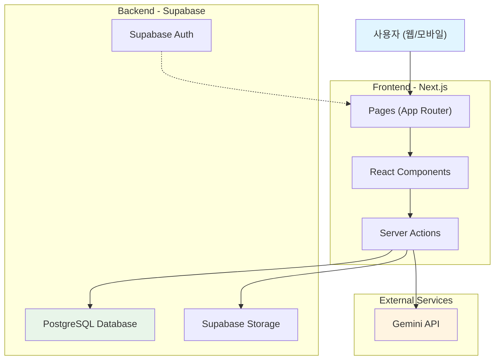
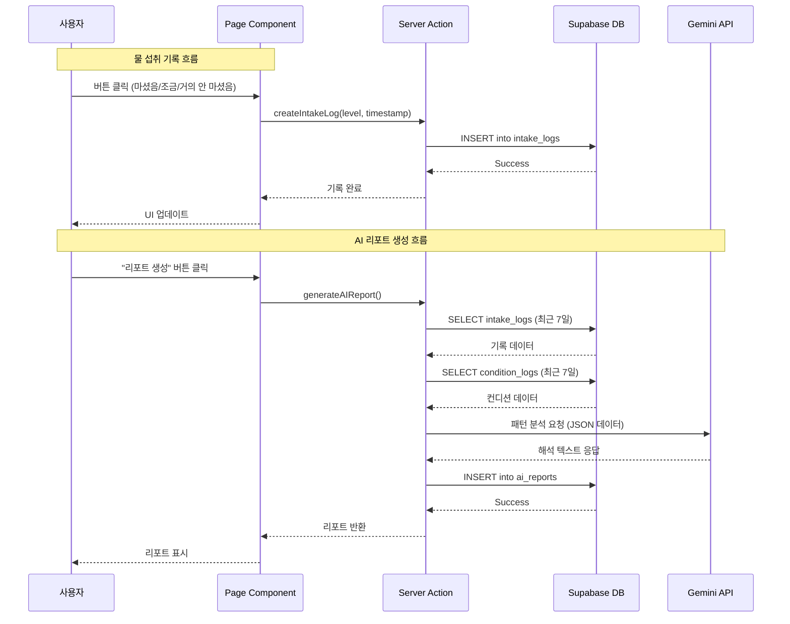
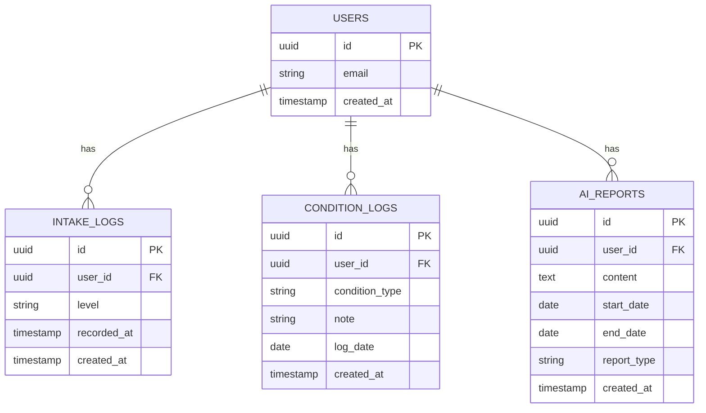
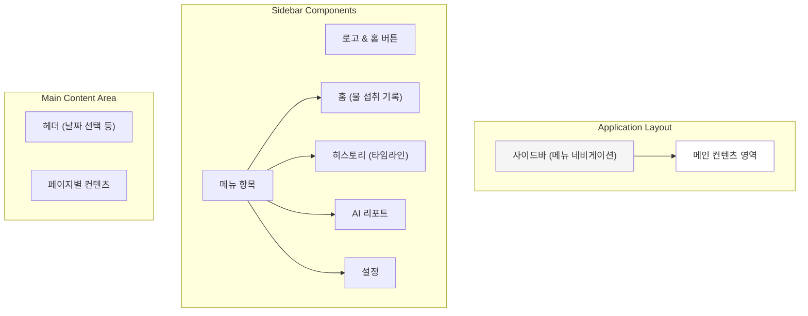
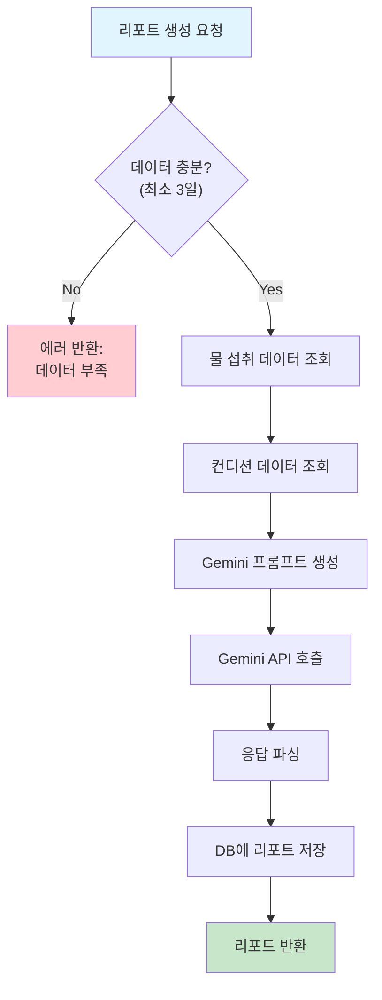

# 🏗️ Software Design & Architecture Document

> **목적**: Water Log 서비스의 기술 스택, 아키텍처, 데이터베이스, 프론트엔드/백엔드 설계를 종합적으로 정의

**작성 기준**: [PRD.md](file:///Users/hahahoho/Desktop/workspace/251219-water-log-v3/docs/PRD.md), [user_stories.md](file:///Users/hahahoho/Desktop/workspace/251219-water-log-v3/docs/user_stories.md)  
**문서 버전**: 1.0  
**최종 수정일**: 2025-12-19

---

## 1. 기술 스택 (Technology Stack)

### 1.1 프론트엔드 / 백엔드

| 카테고리 | 기술 | 버전 | 용도 |
|---------|------|------|------|
| **프레임워크** | Next.js | 14.x | React 기반 풀스택 프레임워크 |
| **라우팅** | App Router | - | 서버/클라이언트 컴포넌트 통합 라우팅 |
| **언어** | TypeScript | 5.x | 타입 안정성 확보 |
| **스타일링** | Tailwind CSS | 3.x | 유틸리티 기반 CSS 프레임워크 |
| **상태 관리** | React Hooks | - | 클라이언트 상태 관리 |
| **날짜 라이브러리** | date-fns | 3.x | 날짜 계산 및 포맷팅 |

### 1.2 백엔드 / 데이터베이스

| 카테고리 | 기술 | 버전 | 용도 |
|---------|------|------|------|
| **Database** | Supabase (PostgreSQL) | - | 관계형 데이터베이스 |
| **인증** | Supabase Auth | - | 사용자 인증 (MVP 제외) |
| **실시간 DB** | Supabase Realtime | - | 실시간 데이터 동기화 |
| **Storage** | Supabase Storage | - | AI 리포트 텍스트 저장 |
| **Server Actions** | Next.js Server Actions | - | 서버 사이드 로직 처리 |

### 1.3 AI / 외부 API

| 카테고리 | 기술 | 용도 |
|---------|------|------|
| **AI 모델** | Google Gemini API | 물 섭취 패턴 해석 및 리포트 생성 |
| **API 키 관리** | Environment Variables | `.env.local`을 통한 보안 관리 |

### 1.4 배포 / 인프라 

| 카테고리 | 기술 | 용도 |
|---------|------|------|
| **호스팅** | Vercel | Next.js 최적화 배포 플랫폼 |
| **CI/CD** | Vercel Auto Deploy | Git push 시 자동 배포 |
| **환경 변수** | Vercel Environment Variables | API 키 및 DB 연결 정보 관리 |

---

## 2. 시스템 아키텍처 (System Architecture)

### 2.1 전체 시스템 아키텍처



### 2.2 데이터 흐름 (Data Flow)



---

## 3. 데이터베이스 설계 (Database Schema)

### 3.1 ERD (Entity Relationship Diagram)



### 3.2 테이블 상세 스키마

#### 3.2.1 `users` 테이블
> **용도**: 사용자 정보 (MVP에서는 제외, 추후 확장 대비)

| 컬럼명 | 타입 | 제약조건 | 설명 |
|--------|------|----------|------|
| `id` | UUID | PRIMARY KEY | 사용자 고유 ID |
| `email` | VARCHAR(255) | UNIQUE, NOT NULL | 이메일 주소 |
| `created_at` | TIMESTAMP | DEFAULT NOW() | 생성 시각 |

#### 3.2.2 `intake_logs` 테이블
> **용도**: 물 섭취 기록 저장

| 컬럼명 | 타입 | 제약조건 | 설명 |
|--------|------|----------|------|
| `id` | UUID | PRIMARY KEY | 기록 고유 ID |
| `user_id` | UUID | FOREIGN KEY, NOT NULL | 사용자 ID |
| `level` | VARCHAR(50) | NOT NULL | 섭취량 레벨 (`high`, `medium`, `low`) |
| `recorded_at` | TIMESTAMP | NOT NULL | 기록된 시간 |
| `created_at` | TIMESTAMP | DEFAULT NOW() | DB 저장 시각 |

**인덱스**:
- `idx_intake_user_recorded` ON (`user_id`, `recorded_at` DESC)

**제약조건**:
- `level` CHECK (level IN ('high', 'medium', 'low'))

#### 3.2.3 `condition_logs` 테이블
> **용도**: 사용자 컨디션 메모 저장

| 컬럼명 | 타입 | 제약조건 | 설명 |
|--------|------|----------|------|
| `id` | UUID | PRIMARY KEY | 컨디션 로그 ID |
| `user_id` | UUID | FOREIGN KEY, NOT NULL | 사용자 ID |
| `condition_type` | VARCHAR(50) | NOT NULL | 컨디션 유형 (`fatigue`, `swelling`, `good`) |
| `note` | TEXT | NULL | 추가 메모 (선택) |
| `log_date` | DATE | NOT NULL | 기록 날짜 |
| `created_at` | TIMESTAMP | DEFAULT NOW() | DB 저장 시각 |

**인덱스**:
- `idx_condition_user_date` ON (`user_id`, `log_date` DESC)

**제약조건**:
- UNIQUE (`user_id`, `log_date`) - 하루 1회만 기록

#### 3.2.4 `ai_reports` 테이블
> **용도**: AI 생성 리포트 저장

| 컬럼명 | 타입 | 제약조건 | 설명 |
|--------|------|----------|------|
| `id` | UUID | PRIMARY KEY | 리포트 ID |
| `user_id` | UUID | FOREIGN KEY, NOT NULL | 사용자 ID |
| `content` | TEXT | NOT NULL | AI 생성 리포트 내용 |
| `start_date` | DATE | NOT NULL | 분석 시작 날짜 |
| `end_date` | DATE | NOT NULL | 분석 종료 날짜 |
| `report_type` | VARCHAR(50) | NOT NULL | 리포트 유형 (`weekly`, `manual`) |
| `created_at` | TIMESTAMP | DEFAULT NOW() | 생성 시각 |

**인덱스**:
- `idx_reports_user_created` ON (`user_id`, `created_at` DESC)

### 3.3 데이터베이스 초기화 SQL

```sql
-- users 테이블 (추후 확장 대비)
CREATE TABLE users (
  id UUID PRIMARY KEY DEFAULT uuid_generate_v4(),
  email VARCHAR(255) UNIQUE NOT NULL,
  created_at TIMESTAMP DEFAULT NOW()
);

-- intake_logs 테이블
CREATE TABLE intake_logs (
  id UUID PRIMARY KEY DEFAULT uuid_generate_v4(),
  user_id UUID NOT NULL REFERENCES users(id) ON DELETE CASCADE,
  level VARCHAR(50) NOT NULL CHECK (level IN ('high', 'medium', 'low')),
  recorded_at TIMESTAMP NOT NULL,
  created_at TIMESTAMP DEFAULT NOW()
);

CREATE INDEX idx_intake_user_recorded ON intake_logs(user_id, recorded_at DESC);

-- condition_logs 테이블
CREATE TABLE condition_logs (
  id UUID PRIMARY KEY DEFAULT uuid_generate_v4(),
  user_id UUID NOT NULL REFERENCES users(id) ON DELETE CASCADE,
  condition_type VARCHAR(50) NOT NULL,
  note TEXT,
  log_date DATE NOT NULL,
  created_at TIMESTAMP DEFAULT NOW(),
  UNIQUE(user_id, log_date)
);

CREATE INDEX idx_condition_user_date ON condition_logs(user_id, log_date DESC);

-- ai_reports 테이블
CREATE TABLE ai_reports (
  id UUID PRIMARY KEY DEFAULT uuid_generate_v4(),
  user_id UUID NOT NULL REFERENCES users(id) ON DELETE CASCADE,
  content TEXT NOT NULL,
  start_date DATE NOT NULL,
  end_date DATE NOT NULL,
  report_type VARCHAR(50) NOT NULL CHECK (report_type IN ('weekly', 'manual')),
  created_at TIMESTAMP DEFAULT NOW()
);

CREATE INDEX idx_reports_user_created ON ai_reports(user_id, created_at DESC);
```

---

## 4. 프론트엔드 설계 (Frontend Design)

### 4.1 디자인 컨셉

> **핵심 컨셉**: 구글 캘린더 스타일의 깔끔하고 직관적인 UI

#### 디자인 원칙
1. **미니멀리즘**: 불필요한 요소 제거, 핵심 기능에 집중
2. **반응형 디자인**: 모바일(320px~) ~ 데스크톱(1920px+) 대응
3. **접근성**: WCAG 2.1 AA 수준 준수
4. **일관성**: 구글 머티리얼 디자인 가이드라인 참고

### 4.2 레이아웃 구조



### 4.3 화면 설계

#### 4.3.1 메인 페이지 (홈 - 물 섭취 기록)

**경로**: `/`

**레이아웃**:
```
┌─────────────────────────────────────┐
│ [사이드바]  │  [메인 컨텐츠]        │
│             │                        │
│ 🏠 홈       │  📅 2025년 12월 19일   │
│ 📊 히스토리 │  ────────────────────  │
│ 🤖 AI 리포트│                        │
│ ⚙️ 설정     │  오늘의 물 섭취 기록   │
│             │                        │
│             │  [ 마셨음 ]            │
│             │  [ 조금 마셨음 ]       │
│             │  [ 거의 안 마셨음 ]    │
│             │                        │
│             │  ─ 오늘의 기록 ─       │
│             │  • 14:30 - 마셨음     │
│             │  • 10:15 - 조금 마셨음│
└─────────────────────────────────────┘
```

**컴포넌트 구조**:
- `IntakeRecorder`: 물 섭취 기록 버튼 그룹
- `TodayIntakeList`: 오늘 기록 목록
- `ConditionInput`: 컨디션 메모 입력 (선택)

#### 4.3.2 히스토리 페이지 (타임라인/캘린더)

**경로**: `/history`

**레이아웃**:
```
┌─────────────────────────────────────┐
│ [사이드바]  │  [캘린더 뷰]          │
│             │                        │
│             │  ◀ 2025년 12월 ▶      │
│             │                        │
│             │  일 월 화 수 목 금 토  │
│             │  1  2  3  4  5  6  7  │
│             │  💧💧 💧    💧💧💧  │
│             │  8  9 10 11 12 13 14  │
│             │  💧    💧💧    💧   │
│             │  ...                   │
│             │                        │
│             │  [선택한 날짜 상세]    │
│             │  2025-12-19           │
│             │  • 14:30 마셨음       │
└─────────────────────────────────────┘
```

**컴포넌트 구조**:
- `CalendarView`: 월간 캘린더
- `DayDetail`: 선택한 날짜 상세 기록
- `WeeklyChart`: 주간 패턴 차트 (선택)

#### 4.3.3 AI 리포트 페이지

**경로**: `/reports`

**레이아웃**:
```
┌─────────────────────────────────────┐
│ [사이드바]  │  [리포트 목록]        │
│             │                        │
│             │  [ + 새 리포트 생성 ] │
│             │                        │
│             │  ─ 최근 리포트 ─       │
│             │                        │
│             │  📄 12월 3주차 리포트 │
│             │  2025-12-13 ~ 12-19   │
│             │  "지난주보다 오후 물   │
│             │   섭취가 늘었어요..."  │
│             │                        │
│             │  📄 12월 2주차 리포트 │
│             │  2025-12-06 ~ 12-12   │
│             │  "물이 적었던 날에..." │
└─────────────────────────────────────┘
```

**컴포넌트 구조**:
- `ReportGenerator`: 리포트 생성 버튼 + 로딩 상태
- `ReportList`: 리포트 목록
- `ReportCard`: 개별 리포트 카드
- `ReportDetail`: 리포트 상세 모달/페이지

### 4.4 반응형 브레이크포인트

| 디바이스 | 브레이크포인트 | 레이아웃 변경 |
|---------|---------------|--------------|
| **모바일** | 320px ~ 767px | 사이드바 → 하단 탭바 또는 햄버거 메뉴 |
| **태블릿** | 768px ~ 1023px | 축소된 사이드바 (아이콘만) |
| **데스크톱** | 1024px ~ | 전체 사이드바 표시 |

### 4.5 컬러 팔레트 (구글 캘린더 스타일)

```css
/* Primary Colors */
--primary-blue: #1a73e8;
--primary-blue-hover: #1557b0;

/* Secondary Colors */
--water-blue: #4fc3f7;
--success-green: #34a853;
--warning-yellow: #fbbc04;

/* Neutral Colors */
--bg-white: #ffffff;
--bg-gray-50: #f8f9fa;
--bg-gray-100: #f1f3f4;
--text-primary: #202124;
--text-secondary: #5f6368;
--border-gray: #dadce0;

/* Water Level Colors */
--level-high: #0288d1;     /* 많이 마셨음 */
--level-medium: #4fc3f7;   /* 조금 마셨음 */
--level-low: #b3e5fc;      /* 거의 안 마셨음 */
```

### 4.6 주요 컴포넌트 설계

#### 컴포넌트 디렉토리 구조

```
src/
├── app/
│   ├── (main)/
│   │   ├── layout.tsx           # 메인 레이아웃 (사이드바 포함)
│   │   ├── page.tsx             # 홈 페이지
│   │   ├── history/
│   │   │   └── page.tsx         # 히스토리 페이지
│   │   └── reports/
│   │       ├── page.tsx         # 리포트 목록
│   │       └── [id]/
│   │           └── page.tsx     # 리포트 상세
│   └── globals.css              # 글로벌 스타일
├── components/
│   ├── layout/
│   │   ├── Sidebar.tsx          # 사이드바
│   │   └── MobileNav.tsx        # 모바일 네비게이션
│   ├── features/
│   │   ├── intake/
│   │   │   ├── IntakeRecorder.tsx
│   │   │   └── IntakeList.tsx
│   │   ├── history/
│   │   │   ├── CalendarView.tsx
│   │   │   └── DayDetail.tsx
│   │   └── reports/
│   │       ├── ReportGenerator.tsx
│   │       ├── ReportList.tsx
│   │       └── ReportCard.tsx
│   └── ui/
│       ├── Button.tsx
│       ├── Card.tsx
│       └── Modal.tsx
└── lib/
    ├── supabase.ts
    └── utils.ts
```

---

## 5. 백엔드 설계 (Backend Design)

### 5.1 Server Actions 설계

> Next.js Server Actions를 활용한 서버 사이드 로직 처리

#### 5.1.1 물 섭취 관련 Server Actions

**파일**: `src/actions/intake.ts`

```typescript
// 물 섭취 기록 생성
export async function createIntakeLog(
  level: 'high' | 'medium' | 'low',
  recordedAt: Date
): Promise<{ success: boolean; data?: IntakeLog; error?: string }>

// 특정 날짜의 물 섭취 기록 조회
export async function getIntakeLogsByDate(
  date: Date
): Promise<{ success: boolean; data?: IntakeLog[]; error?: string }>

// 날짜 범위의 물 섭취 기록 조회
export async function getIntakeLogsByDateRange(
  startDate: Date,
  endDate: Date
): Promise<{ success: boolean; data?: IntakeLog[]; error?: string }>

// 물 섭취 기록 삭제
export async function deleteIntakeLog(
  logId: string
): Promise<{ success: boolean; error?: string }>
```

#### 5.1.2 컨디션 관련 Server Actions

**파일**: `src/actions/condition.ts`

```typescript
// 컨디션 로그 생성/수정 (하루 1회)
export async function upsertConditionLog(
  conditionType: 'fatigue' | 'swelling' | 'good',
  logDate: Date,
  note?: string
): Promise<{ success: boolean; data?: ConditionLog; error?: string }>

// 특정 날짜의 컨디션 조회
export async function getConditionByDate(
  date: Date
): Promise<{ success: boolean; data?: ConditionLog; error?: string }>

// 날짜 범위의 컨디션 조회
export async function getConditionsByDateRange(
  startDate: Date,
  endDate: Date
): Promise<{ success: boolean; data?: ConditionLog[]; error?: string }>
```

#### 5.1.3 AI 리포트 관련 Server Actions

**파일**: `src/actions/reports.ts`

```typescript
// AI 리포트 생성
export async function generateAIReport(
  startDate: Date,
  endDate: Date,
  reportType: 'weekly' | 'manual'
): Promise<{ success: boolean; data?: AIReport; error?: string }>

// 리포트 목록 조회
export async function getReportList(): Promise<{
  success: boolean;
  data?: AIReport[];
  error?: string;
}>

// 특정 리포트 조회
export async function getReportById(
  reportId: string
): Promise<{ success: boolean; data?: AIReport; error?: string }>
```

### 5.2 Gemini API 통합 설계

#### 5.2.1 AI 리포트 생성 플로우



#### 5.2.2 Gemini API 프롬프트 설계

**파일**: `src/lib/ai/gemini.ts`

```typescript
export function buildReportPrompt(
  intakeLogs: IntakeLog[],
  conditionLogs: ConditionLog[]
): string {
  return `
당신은 사용자의 물 섭취 패턴을 분석하여 공감적이고 긍정적인 인사이트를 제공하는 AI 어시스턴트입니다.

**규칙**:
1. 평가나 훈계 금지
2. "실패", "부족", "못했다" 등 부정적 표현 금지
3. 관찰 → 해석 → 가벼운 제안 순서로 작성
4. 최대 300자 이내로 작성

**데이터**:
- 물 섭취 기록: ${JSON.stringify(intakeLogs)}
- 컨디션 기록: ${JSON.stringify(conditionLogs)}

**출력 예시**:
"완벽하진 않았지만, 지난주보다 오후 물 섭취 빈도가 늘었어요. 특히 화요일과 목요일 오후 3시경에 꾸준히 마신 점이 인상적이에요."
  `;
}
```

#### 5.2.3 API 설정

**환경 변수**: `.env.local`

```env
# Supabase
NEXT_PUBLIC_SUPABASE_URL=your_supabase_url
NEXT_PUBLIC_SUPABASE_ANON_KEY=your_supabase_anon_key

# Gemini API
GEMINI_API_KEY=your_gemini_api_key
```

### 5.3 데이터 검증 및 에러 핸들링

#### 5.3.1 Zod를 활용한 데이터 검증

```typescript
import { z } from 'zod';

// 물 섭취 기록 스키마
export const IntakeLogSchema = z.object({
  level: z.enum(['high', 'medium', 'low']),
  recordedAt: z.date(),
});

// 컨디션 로그 스키마
export const ConditionLogSchema = z.object({
  conditionType: z.enum(['fatigue', 'swelling', 'good']),
  logDate: z.date(),
  note: z.string().max(500).optional(),
});

// AI 리포트 요청 스키마
export const ReportRequestSchema = z.object({
  startDate: z.date(),
  endDate: z.date(),
  reportType: z.enum(['weekly', 'manual']),
});
```

#### 5.3.2 에러 핸들링 전략

| 에러 유형 | 처리 방법 |
|----------|-----------|
| **DB 연결 실패** | 재시도(3회) → 사용자에게 안내 메시지 |
| **데이터 검증 실패** | 상세 에러 메시지 반환 |
| **Gemini API 실패** | 캐시된 기본 메시지 반환 또는 재시도 |
| **인증 실패** | 로그인 페이지로 리다이렉트 (추후 구현) |

---

## 6. API 엔드포인트 설계 (Next.js Server Actions)

### 6.1 엔드포인트 목록

| 기능 | Server Action | HTTP Method | 경로 |
|------|--------------|-------------|------|
| **물 섭취 기록 생성** | `createIntakeLog` | POST | Server Action |
| **물 섭취 기록 조회** | `getIntakeLogsByDate` | GET | Server Action |
| **물 섭취 기록 삭제** | `deleteIntakeLog` | DELETE | Server Action |
| **컨디션 로그 생성** | `upsertConditionLog` | POST | Server Action |
| **컨디션 로그 조회** | `getConditionByDate` | GET | Server Action |
| **AI 리포트 생성** | `generateAIReport` | POST | Server Action |
| **리포트 목록 조회** | `getReportList` | GET | Server Action |
| **리포트 상세 조회** | `getReportById` | GET | Server Action |

---

## 7. 보안 및 성능 최적화

### 7.1 보안 설계

| 항목 | 방법 |
|------|------|
| **API 키 관리** | 환경 변수 사용, `.env.local` gitignore 등록 |
| **데이터 액세스** | Supabase RLS (Row Level Security) 정책 적용 |
| **입력 검증** | Zod 스키마 검증 |
| **CSRF 방지** | Next.js Server Actions 자동 처리 |

### 7.2 성능 최적화

| 항목 | 방법 |
|------|------|
| **이미지 최적화** | Next.js Image 컴포넌트 사용 |
| **데이터 캐싱** | React Server Components 활용 |
| **코드 스플리팅** | Dynamic Import 활용 |
| **DB 인덱싱** | user_id, recorded_at, log_date 인덱스 |
| **번들 사이즈** | Tree Shaking, 불필요한 라이브러리 제거 |

---

## 8. 배포 전략

### 8.1 Vercel 배포 설정

```json
// vercel.json
{
  "framework": "nextjs",
  "buildCommand": "npm run build",
  "devCommand": "npm run dev",
  "installCommand": "npm install",
  "env": {
    "NEXT_PUBLIC_SUPABASE_URL": "@supabase-url",
    "NEXT_PUBLIC_SUPABASE_ANON_KEY": "@supabase-anon-key",
    "GEMINI_API_KEY": "@gemini-api-key"
  }
}
```

### 8.2 배포 체크리스트

- [ ] 환경 변수 설정 (Vercel Dashboard)
- [ ] Supabase 프로젝트 연결
- [ ] Gemini API 키 발급 및 등록
- [ ] 데이터베이스 마이그레이션 실행
- [ ] 프로덕션 빌드 테스트
- [ ] 성능 모니터링 설정 (Vercel Analytics)

---

## 9. 향후 확장 계획

### 9.1 Phase 2 기능

- **인증 시스템**: Supabase Auth 통합
- **알림 시스템**: 맥락 기반 푸시 알림
- **소셜 공유**: 주간 리포트 공유 기능
- **홈 위젯**: iOS/Android 위젯 지원

### 9.2 기술적 확장

- **PWA**: Progressive Web App 지원
- **오프라인 모드**: Service Worker 활용
- **다국어 지원**: i18n 통합
- **A/B 테스팅**: Vercel Edge Config 활용

---

## 10. 문서 히스토리

| 버전 | 날짜 | 변경 내용 | 작성자 |
|------|------|-----------|--------|
| 1.0 | 2025-12-19 | 초기 문서 작성 | AI |

---

**참고 문서**:
- [PRD.md](file:///Users/hahahoho/Desktop/workspace/251219-water-log-v3/docs/PRD.md)
- [user_stories.md](file:///Users/hahahoho/Desktop/workspace/251219-water-log-v3/docs/user_stories.md)
