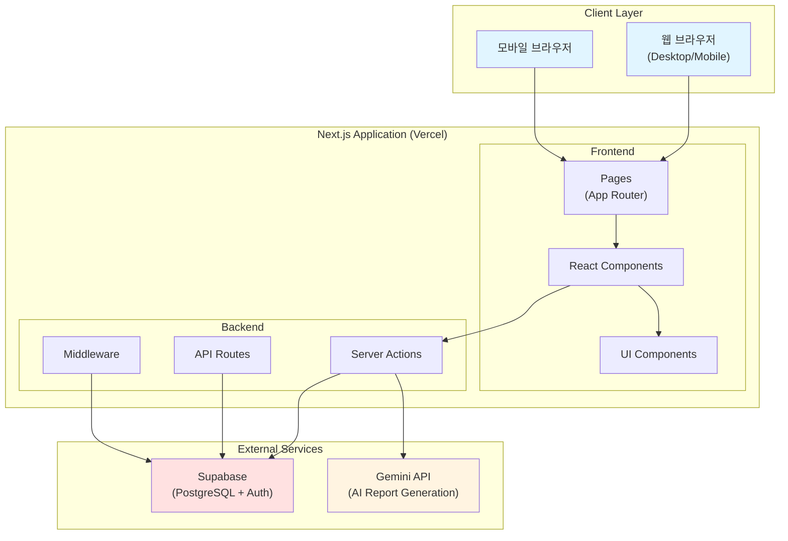
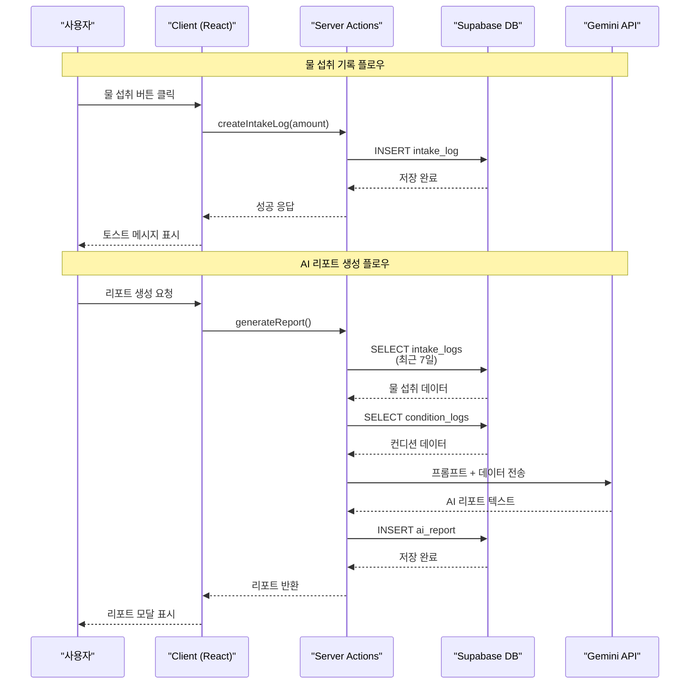
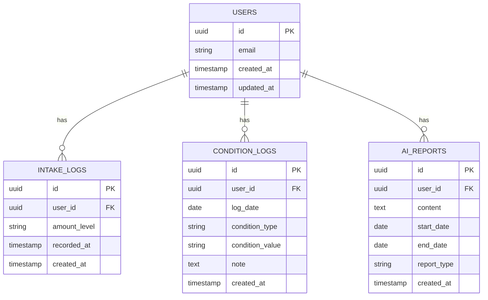
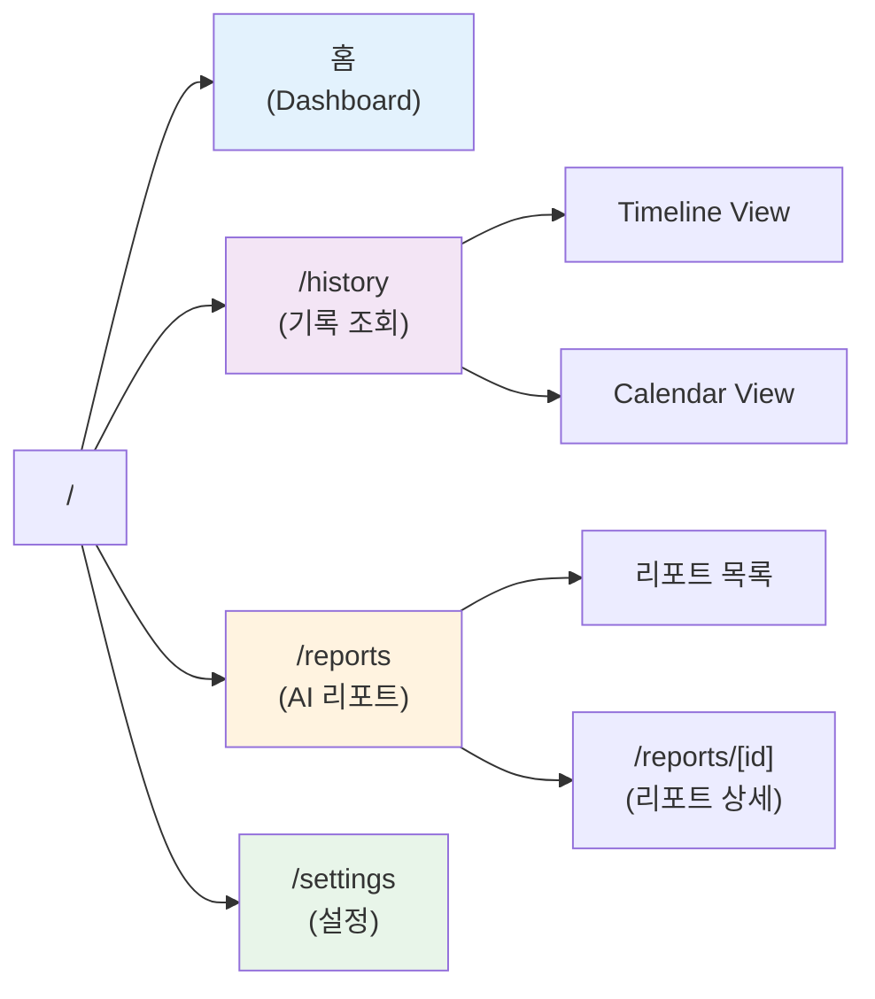
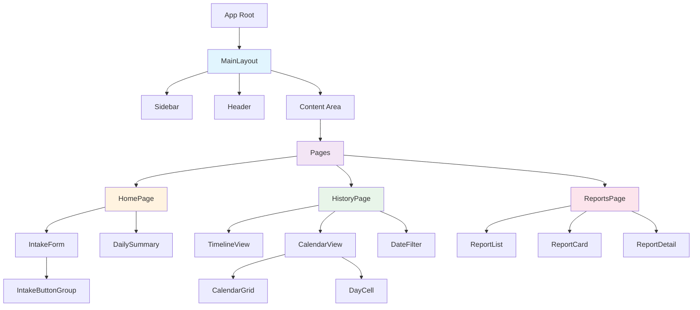

# 📐 Software Design & Architecture

## 목차
1. [개요](#개요)
2. [기술 스택](#기술-스택)
3. [시스템 아키텍처](#시스템-아키텍처)
4. [데이터베이스 설계](#데이터베이스-설계)
5. [프론트엔드 설계](#프론트엔드-설계)
6. [백엔드 설계](#백엔드-설계)
7. [보안 및 인증](#보안-및-인증)
8. [배포 전략](#배포-전략)

---

## 개요

Water Log는 사용자의 물 섭취 습관을 기록하고 AI 기반으로 의미 있는 인사이트를 제공하는 웹 기반 애플리케이션입니다. Next.js 기반의 풀스택 애플리케이션으로, Supabase를 데이터베이스 및 인증 시스템으로 사용하며, Google Gemini API를 통해 AI 리포트를 생성합니다.

### 핵심 원칙
- **무부담 기록**: 숫자 입력 없이 선택 버튼만으로 기록
- **실패 없는 경험**: 기록 누락을 실패로 간주하지 않음
- **의미 있는 해석**: AI를 통한 패턴 분석과 공감적 리포트 제공
- **반응형 디자인**: 웹과 모바일 모두에서 최적화된 UX

---

## 기술 스택

### Frontend
| 기술 | 버전 | 용도 |
|------|------|------|
| **Next.js** | 14+ (App Router) | React 기반 풀스택 프레임워크 |
| **TypeScript** | 5.0+ | 타입 안전성 보장 |
| **Tailwind CSS** | 3.0+ | 유틸리티 기반 스타일링 |
| **React Hook Form** | 7.0+ | 폼 상태 관리 |
| **date-fns** | 2.0+ | 날짜 계산 및 포맷팅 |
| **Radix UI** | 최신 | 접근성 보장 UI 컴포넌트 |

### Backend
| 기술 | 버전 | 용도 |
|------|------|------|
| **Next.js Server Actions** | 14+ | 서버 사이드 로직 |
| **Supabase** | 최신 | PostgreSQL DB + Auth + Storage |
| **Supabase RLS** | - | Row Level Security 정책 |

### AI & External APIs
| 기술 | 용도 |
|------|------|
| **Google Gemini API** | AI 기반 리포트 생성 (gemini-2.0-flash-exp) |

### DevOps & Deployment
| 기술 | 용도 |
|------|------|
| **Vercel** | Next.js 애플리케이션 배포 |
| **Git** | 버전 관리 |
| **ESLint + Prettier** | 코드 품질 및 포맷팅 |

---

## 시스템 아키텍처

### 전체 시스템 아키텍처


```mermaid
graph TB
    subgraph "Client Layer"
        WEB["웹 브라우저<br/>(Desktop/Mobile)"]
        MOBILE["모바일 브라우저"]
    end
    
    subgraph "Next.js Application (Vercel)"
        subgraph "Frontend"
            PAGES["Pages<br/>(App Router)"]
            COMPONENTS["React Components"]
            UI["UI Components"]
        end
        
        subgraph "Backend"
            SA["Server Actions"]
            API["API Routes"]
            MIDDLEWARE["Middleware"]
        end
    end
    
    subgraph "External Services"
        SUPABASE["Supabase<br/>(PostgreSQL + Auth)"]
        GEMINI["Gemini API<br/>(AI Report Generation)"]
    end
    
    WEB --> PAGES
    MOBILE --> PAGES
    PAGES --> COMPONENTS
    COMPONENTS --> UI
    COMPONENTS --> SA
    SA --> SUPABASE
    SA --> GEMINI
    API --> SUPABASE
    MIDDLEWARE --> SUPABASE
    
    style WEB fill:#e1f5ff
    style MOBILE fill:#e1f5ff
    style SUPABASE fill:#ffe1e1
    style GEMINI fill:#fff4e1
```

### 데이터 플로우


```mermaid
sequenceDiagram
    participant U as "사용자"
    participant C as "Client (React)"
    participant SA as "Server Actions"
    participant DB as "Supabase DB"
    participant AI as "Gemini API"
    
    Note over U,AI: 물 섭취 기록 플로우
    U->>C: 물 섭취 버튼 클릭
    C->>SA: createIntakeLog(amount)
    SA->>DB: INSERT intake_log
    DB-->>SA: 저장 완료
    SA-->>C: 성공 응답
    C-->>U: 토스트 메시지 표시
    
    Note over U,AI: AI 리포트 생성 플로우
    U->>C: 리포트 생성 요청
    C->>SA: generateReport()
    SA->>DB: SELECT intake_logs<br/>(최근 7일)
    DB-->>SA: 물 섭취 데이터
    SA->>DB: SELECT condition_logs
    DB-->>SA: 컨디션 데이터
    SA->>AI: 프롬프트 + 데이터 전송
    AI-->>SA: AI 리포트 텍스트
    SA->>DB: INSERT ai_report
    DB-->>SA: 저장 완료
    SA-->>C: 리포트 반환
    C-->>U: 리포트 모달 표시
```

---

## 데이터베이스 설계

### ERD (Entity Relationship Diagram)


```mermaid
erDiagram
    USERS ||--o{ INTAKE_LOGS : "has"
    USERS ||--o{ CONDITION_LOGS : "has"
    USERS ||--o{ AI_REPORTS : "has"
    
    USERS {
        uuid id PK
        string email
        timestamp created_at
        timestamp updated_at
    }
    
    INTAKE_LOGS {
        uuid id PK
        uuid user_id FK
        string amount_level
        timestamp recorded_at
        timestamp created_at
    }
    
    CONDITION_LOGS {
        uuid id PK
        uuid user_id FK
        date log_date
        string condition_type
        string condition_value
        text note
        timestamp created_at
    }
    
    AI_REPORTS {
        uuid id PK
        uuid user_id FK
        text content
        date start_date
        date end_date
        string report_type
        timestamp created_at
    }
```

### 테이블 상세 스키마

#### 1. `intake_logs` (물 섭취 기록)

```sql
CREATE TABLE intake_logs (
  id UUID PRIMARY KEY DEFAULT gen_random_uuid(),
  user_id UUID NOT NULL REFERENCES auth.users(id) ON DELETE CASCADE,
  amount_level VARCHAR(50) NOT NULL CHECK (amount_level IN ('high', 'medium', 'low')),
  recorded_at TIMESTAMPTZ NOT NULL DEFAULT NOW(),
  created_at TIMESTAMPTZ NOT NULL DEFAULT NOW(),
  
  -- 인덱스
  INDEX idx_intake_logs_user_id (user_id),
  INDEX idx_intake_logs_recorded_at (recorded_at)
);

-- RLS 정책
ALTER TABLE intake_logs ENABLE ROW LEVEL SECURITY;

CREATE POLICY "Users can view own intake logs"
  ON intake_logs FOR SELECT
  USING (auth.uid() = user_id);

CREATE POLICY "Users can insert own intake logs"
  ON intake_logs FOR INSERT
  WITH CHECK (auth.uid() = user_id);

CREATE POLICY "Users can delete own intake logs"
  ON intake_logs FOR DELETE
  USING (auth.uid() = user_id);
```

**필드 설명:**
- `amount_level`: 물 섭취 수준
  - `high`: 마셨음 (500ml 이상 참고용)
  - `medium`: 조금 마셨음 (200-500ml 참고용)
  - `low`: 거의 안 마셨음 (200ml 미만 참고용)
- `recorded_at`: 실제 물을 마신 시간 (사용자가 선택하거나 기본값은 현재 시간)

---

#### 2. `condition_logs` (컨디션 메모)

```sql
CREATE TABLE condition_logs (
  id UUID PRIMARY KEY DEFAULT gen_random_uuid(),
  user_id UUID NOT NULL REFERENCES auth.users(id) ON DELETE CASCADE,
  log_date DATE NOT NULL,
  condition_type VARCHAR(50) NOT NULL CHECK (condition_type IN ('fatigue', 'swelling', 'skin', 'energy', 'sleep', 'other')),
  condition_value VARCHAR(50) NOT NULL CHECK (condition_value IN ('very_good', 'good', 'normal', 'bad', 'very_bad')),
  note TEXT,
  created_at TIMESTAMPTZ NOT NULL DEFAULT NOW(),
  
  -- 하루에 한 번만 기록 가능
  UNIQUE(user_id, log_date, condition_type),
  
  -- 인덱스
  INDEX idx_condition_logs_user_id (user_id),
  INDEX idx_condition_logs_date (log_date)
);

-- RLS 정책
ALTER TABLE condition_logs ENABLE ROW LEVEL SECURITY;

CREATE POLICY "Users can view own condition logs"
  ON condition_logs FOR SELECT
  USING (auth.uid() = user_id);

CREATE POLICY "Users can insert own condition logs"
  ON condition_logs FOR INSERT
  WITH CHECK (auth.uid() = user_id);

CREATE POLICY "Users can update own condition logs"
  ON condition_logs FOR UPDATE
  USING (auth.uid() = user_id);
```

**필드 설명:**
- `condition_type`: 컨디션 타입 (피로, 붓기, 피부, 에너지, 수면 등)
- `condition_value`: 컨디션 수준 (매우 좋음 ~ 매우 나쁨)
- `log_date`: 기록 날짜 (하루 1회 제한)

---

#### 3. `ai_reports` (AI 리포트)

```sql
CREATE TABLE ai_reports (
  id UUID PRIMARY KEY DEFAULT gen_random_uuid(),
  user_id UUID NOT NULL REFERENCES auth.users(id) ON DELETE CASCADE,
  content TEXT NOT NULL,
  start_date DATE NOT NULL,
  end_date DATE NOT NULL,
  report_type VARCHAR(50) NOT NULL DEFAULT 'weekly' CHECK (report_type IN ('weekly', 'custom', 'monthly')),
  created_at TIMESTAMPTZ NOT NULL DEFAULT NOW(),
  
  -- 인덱스
  INDEX idx_ai_reports_user_id (user_id),
  INDEX idx_ai_reports_created_at (created_at)
);

-- RLS 정책
ALTER TABLE ai_reports ENABLE ROW LEVEL SECURITY;

CREATE POLICY "Users can view own reports"
  ON ai_reports FOR SELECT
  USING (auth.uid() = user_id);

CREATE POLICY "Users can insert own reports"
  ON ai_reports FOR INSERT
  WITH CHECK (auth.uid() = user_id);
```

**필드 설명:**
- `content`: AI가 생성한 리포트 전문 (마크다운 형식)
- `start_date`, `end_date`: 리포트가 분석한 기간
- `report_type`: 리포트 유형 (주간/월간/커스텀)

---

## 프론트엔드 설계

### 디자인 시스템

#### 디자인 방향
- **Google Calendar 스타일**: 깔끔하고 직관적인 캘린더 중심 UI
- **Material 3 원칙**: 부드러운 그림자, 라운드 코너, 명확한 계층 구조
- **색상 팔레트**:
  - Primary: `#1976d2` (블루)
  - Secondary: `#00bcd4` (시안)
  - Success: `#4caf50` (그린)
  - Warning: `#ff9800` (오렌지)
  - Error: `#f44336` (레드)
  - Neutral: `#f5f5f5` (라이트 그레이)

#### 반응형 브레이크포인트
```css
/* Mobile First Approach */
sm: 640px   /* 모바일 가로 */
md: 768px   /* 태블릿 */
lg: 1024px  /* 데스크톱 */
xl: 1280px  /* 와이드 데스크톱 */
```

---

### 페이지 구조 및 라우팅


```mermaid
graph LR
    ROOT["/"] --> HOME["홈<br/>(Dashboard)"]
    ROOT --> HISTORY["/history<br/>(기록 조회)"]
    ROOT --> REPORTS["/reports<br/>(AI 리포트)"]
    ROOT --> SETTINGS["/settings<br/>(설정)"]
    
    HISTORY --> TIMELINE["Timeline View"]
    HISTORY --> CALENDAR["Calendar View"]
    
    REPORTS --> LIST["리포트 목록"]
    REPORTS --> DETAIL["/reports/[id]<br/>(리포트 상세)"]
    
    style HOME fill:#e3f2fd
    style HISTORY fill:#f3e5f5
    style REPORTS fill:#fff3e0
    style SETTINGS fill:#e8f5e9
```

#### 라우팅 구조

```
app/
├── (main)/                    # 메인 레이아웃 (사이드바 포함)
│   ├── layout.tsx            # 공통 레이아웃 (사이드바)
│   ├── page.tsx              # 홈 (Dashboard)
│   ├── history/
│   │   └── page.tsx          # 기록 조회 (Timeline + Calendar)
│   ├── reports/
│   │   ├── page.tsx          # 리포트 목록
│   │   └── [id]/
│   │       └── page.tsx      # 리포트 상세
│   └── settings/
│       └── page.tsx          # 설정
├── api/                       # API Routes (필요 시)
│   └── generate-report/
│       └── route.ts
├── layout.tsx                 # Root 레이아웃
└── globals.css                # 글로벌 스타일
```

---

### UI 레이아웃 구조

#### 데스크톱 레이아웃

```
┌─────────────────────────────────────────────┐
│  Header (Logo + User Info)                  │
├────────┬────────────────────────────────────┤
│        │                                     │
│        │                                     │
│ Side   │                                     │
│ bar    │        Main Content Area            │
│        │                                     │
│ - 홈   │     (Dashboard / History /          │
│ - 기록 │      Reports / Settings)            │
│ - 리포트│                                     │
│ - 설정 │                                     │
│        │                                     │
│        │                                     │
└────────┴────────────────────────────────────┘
```

#### 모바일 레이아웃

```
┌───────────────────────────┐
│  Header + Hamburger Menu  │
├───────────────────────────┤
│                           │
│                           │
│    Main Content Area      │
│                           │
│   (Full Width)            │
│                           │
│                           │
│                           │
├───────────────────────────┤
│  Bottom Navigation        │
│  [홈] [기록] [리포트] [설정]│
└───────────────────────────┘
```

---

### 컴포넌트 구조


```mermaid
graph TD
    APP["App Root"]
    
    APP --> LAYOUT["MainLayout"]
    LAYOUT --> SIDEBAR["Sidebar"]
    LAYOUT --> HEADER["Header"]
    LAYOUT --> CONTENT["Content Area"]
    
    CONTENT --> PAGES["Pages"]
    
    PAGES --> HOME["HomePage"]
    PAGES --> HISTORY["HistoryPage"]
    PAGES --> REPORTS["ReportsPage"]
    
    HOME --> INTAKE["IntakeForm"]
    HOME --> SUMMARY["DailySummary"]
    
    HISTORY --> TIMELINE["TimelineView"]
    HISTORY --> CALENDAR_VIEW["CalendarView"]
    HISTORY --> FILTER["DateFilter"]
    
    REPORTS --> REPORT_LIST["ReportList"]
    REPORTS --> REPORT_CARD["ReportCard"]
    REPORTS --> REPORT_DETAIL["ReportDetail"]
    
    INTAKE --> BUTTON_GROUP["IntakeButtonGroup"]
    CALENDAR_VIEW --> CALENDAR_GRID["CalendarGrid"]
    CALENDAR_VIEW --> DAY_CELL["DayCell"]
    
    style LAYOUT fill:#e1f5fe
    style PAGES fill:#f3e5f5
    style HOME fill:#fff3e0
    style HISTORY fill:#e8f5e9
    style REPORTS fill:#fce4ec
```

#### 컴포넌트 디렉토리 구조

```
components/
├── layout/
│   ├── Sidebar.tsx           # 사이드바 네비게이션
│   ├── Header.tsx            # 헤더
│   └── MobileNav.tsx         # 모바일 하단 네비게이션
│
├── features/
│   ├── intake/
│   │   ├── IntakeForm.tsx           # 물 섭취 기록 폼
│   │   ├── IntakeButtonGroup.tsx    # 섭취량 선택 버튼
│   │   └── DailySummary.tsx         # 오늘의 요약
│   │
│   ├── history/
│   │   ├── TimelineView.tsx         # 타임라인 뷰
│   │   ├── CalendarView.tsx         # 캘린더 뷰
│   │   ├── CalendarGrid.tsx         # 캘린더 그리드
│   │   ├── DayCell.tsx             # 날짜 셀
│   │   └── DateFilter.tsx          # 날짜 필터
│   │
│   ├── reports/
│   │   ├── ReportList.tsx          # 리포트 목록
│   │   ├── ReportCard.tsx          # 리포트 카드
│   │   ├── ReportDetail.tsx        # 리포트 상세
│   │   └── GenerateReportButton.tsx # 리포트 생성 버튼
│   │
│   └── condition/
│       └── ConditionForm.tsx       # 컨디션 입력 폼
│
└── ui/                        # 재사용 가능한 UI 컴포넌트
    ├── Button.tsx
    ├── Card.tsx
    ├── Modal.tsx
    ├── Toast.tsx
    ├── Loading.tsx
    └── Calendar.tsx
```

---

### 주요 페이지 UI 설계

#### 1. 홈 페이지 (Dashboard)

**목적**: 빠른 물 섭취 기록 + 오늘의 요약

**레이아웃**:
```
┌────────────────────────────────────┐
│  오늘의 물 섭취                     │
│  ━━━━━━━━━━━━━━━━━━━━━━━━━━━━    │
│                                     │
│  [마셨음] [조금 마셨음] [거의 안 마셨음] │
│                                     │
│  오늘 기록: 3회                     │
├────────────────────────────────────┤
│  최근 기록                          │
│  ━━━━━━━━━━━━━━━━━━━━━━━━━━━━    │
│  • 오후 2:30 - 마셨음              │
│  • 오후 12:00 - 조금 마셨음        │
│  • 오전 10:00 - 마셨음             │
└────────────────────────────────────┘
```

---

#### 2. 기록 조회 페이지 (History)

**목적**: 타임라인 + 캘린더 뷰로 과거 기록 확인

**레이아웃**:
```
┌────────────────────────────────────┐
│  [Timeline] [Calendar]  📅 필터    │
├────────────────────────────────────┤
│  Calendar View (월간)               │
│  ┌──┬──┬──┬──┬──┬──┬──┐          │
│  │월│화│수│목│금│토│일│          │
│  ├──┼──┼──┼──┼──┼──┼──┤          │
│  │  │  │ 1│ 2│ 3│ 4│ 5│          │
│  │ 🔵│ 🟢│ 🟡│  │ 🔵│ 🟢│ 🔵│    │
│  └──┴──┴──┴──┴──┴──┴──┘          │
│                                     │
│  🔵 마셨음  🟢 조금  🟡 거의 안 마심 │
└────────────────────────────────────┘
```

---

#### 3. AI 리포트 페이지 (Reports)

**목적**: 생성된 리포트 목록 + 새 리포트 생성

**레이아웃**:
```
┌────────────────────────────────────┐
│  AI 리포트                          │
│  [+ 새 리포트 생성]      🔍 검색    │
├────────────────────────────────────┤
│  📊 주간 리포트 (12/13 - 12/19)    │
│  "지난주보다 오후 물 섭취 빈도가... │
│  → 12월 20일                        │
├────────────────────────────────────┤
│  📊 주간 리포트 (12/06 - 12/12)    │
│  "완벽하진 않았지만, 평일 오전에... │
│  → 12월 13일                        │
└────────────────────────────────────┘
```

---

## 백엔드 설계

### Server Actions 구조

Next.js App Router의 Server Actions를 활용하여 클라이언트-서버 통신을 단순화합니다.

```
src/actions/
├── intake.ts          # 물 섭취 기록 관련 액션
├── condition.ts       # 컨디션 로그 관련 액션
├── report.ts          # AI 리포트 관련 액션
└── types.ts           # 공통 타입 정의
```

---

### API 설계

#### 1. Intake Actions (`src/actions/intake.ts`)

```typescript
'use server'

import { createServerSupabaseClient } from '@/lib/supabase'
import { revalidatePath } from 'next/cache'

// 물 섭취 기록 생성
export async function createIntakeLog(data: {
  amountLevel: 'high' | 'medium' | 'low'
  recordedAt?: Date
}) {
  const supabase = createServerSupabaseClient()
  
  // 현재 사용자 확인
  const { data: { user } } = await supabase.auth.getUser()
  if (!user) throw new Error('Unauthorized')
  
  // 기록 저장
  const { data: log, error } = await supabase
    .from('intake_logs')
    .insert({
      user_id: user.id,
      amount_level: data.amountLevel,
      recorded_at: data.recordedAt || new Date(),
    })
    .select()
    .single()
  
  if (error) throw error
  
  revalidatePath('/')
  return log
}

// 기간별 물 섭취 기록 조회
export async function getIntakeLogs(params: {
  startDate: Date
  endDate: Date
}) {
  const supabase = createServerSupabaseClient()
  
  const { data: { user } } = await supabase.auth.getUser()
  if (!user) throw new Error('Unauthorized')
  
  const { data, error } = await supabase
    .from('intake_logs')
    .select('*')
    .eq('user_id', user.id)
    .gte('recorded_at', params.startDate.toISOString())
    .lte('recorded_at', params.endDate.toISOString())
    .order('recorded_at', { ascending: false })
  
  if (error) throw error
  return data
}

// 물 섭취 기록 삭제
export async function deleteIntakeLog(logId: string) {
  const supabase = createServerSupabaseClient()
  
  const { error } = await supabase
    .from('intake_logs')
    .delete()
    .eq('id', logId)
  
  if (error) throw error
  
  revalidatePath('/')
  revalidatePath('/history')
}
```

---

#### 2. Report Actions (`src/actions/report.ts`)

```typescript
'use server'

import { createServerSupabaseClient } from '@/lib/supabase'
import { generateAIReport } from '@/lib/gemini'

// AI 리포트 생성
export async function generateReport(params?: {
  startDate?: Date
  endDate?: Date
}) {
  const supabase = createServerSupabaseClient()
  
  const { data: { user } } = await supabase.auth.getUser()
  if (!user) throw new Error('Unauthorized')
  
  // 기본값: 최근 7일
  const endDate = params?.endDate || new Date()
  const startDate = params?.startDate || new Date(Date.now() - 7 * 24 * 60 * 60 * 1000)
  
  // 물 섭취 데이터 조회
  const { data: intakeLogs } = await supabase
    .from('intake_logs')
    .select('*')
    .eq('user_id', user.id)
    .gte('recorded_at', startDate.toISOString())
    .lte('recorded_at', endDate.toISOString())
    .order('recorded_at', { ascending: true })
  
  // 컨디션 데이터 조회
  const { data: conditionLogs } = await supabase
    .from('condition_logs')
    .select('*')
    .eq('user_id', user.id)
    .gte('log_date', startDate.toISOString().split('T')[0])
    .lte('log_date', endDate.toISOString().split('T')[0])
  
  // 데이터 검증
  if (!intakeLogs || intakeLogs.length < 3) {
    throw new Error('최소 3일 이상의 물 섭취 기록이 필요합니다.')
  }
  
  // Gemini API 호출
  const reportContent = await generateAIReport({
    intakeLogs,
    conditionLogs: conditionLogs || [],
    startDate,
    endDate,
  })
  
  // 리포트 저장
  const { data: report, error } = await supabase
    .from('ai_reports')
    .insert({
      user_id: user.id,
      content: reportContent,
      start_date: startDate.toISOString().split('T')[0],
      end_date: endDate.toISOString().split('T')[0],
      report_type: 'weekly',
    })
    .select()
    .single()
  
  if (error) throw error
  
  return report
}

// 리포트 목록 조회
export async function getReports() {
  const supabase = createServerSupabaseClient()
  
  const { data: { user } } = await supabase.auth.getUser()
  if (!user) throw new Error('Unauthorized')
  
  const { data, error } = await supabase
    .from('ai_reports')
    .select('*')
    .eq('user_id', user.id)
    .order('created_at', { ascending: false })
  
  if (error) throw error
  return data
}

// 특정 리포트 조회
export async function getReportById(reportId: string) {
  const supabase = createServerSupabaseClient()
  
  const { data, error } = await supabase
    .from('ai_reports')
    .select('*')
    .eq('id', reportId)
    .single()
  
  if (error) throw error
  return data
}
```

---

#### 3. Condition Actions (`src/actions/condition.ts`)

```typescript
'use server'

import { createServerSupabaseClient } from '@/lib/supabase'

// 컨디션 로그 생성 또는 업데이트 (하루에 1회)
export async function upsertConditionLog(data: {
  logDate: Date
  conditionType: 'fatigue' | 'swelling' | 'skin' | 'energy' | 'sleep' | 'other'
  conditionValue: 'very_good' | 'good' | 'normal' | 'bad' | 'very_bad'
  note?: string
}) {
  const supabase = createServerSupabaseClient()
  
  const { data: { user } } = await supabase.auth.getUser()
  if (!user) throw new Error('Unauthorized')
  
  const { data: log, error } = await supabase
    .from('condition_logs')
    .upsert({
      user_id: user.id,
      log_date: data.logDate.toISOString().split('T')[0],
      condition_type: data.conditionType,
      condition_value: data.conditionValue,
      note: data.note,
    })
    .select()
    .single()
  
  if (error) throw error
  return log
}

// 특정 날짜의 컨디션 조회
export async function getConditionByDate(date: Date) {
  const supabase = createServerSupabaseClient()
  
  const { data: { user } } = await supabase.auth.getUser()
  if (!user) throw new Error('Unauthorized')
  
  const { data, error } = await supabase
    .from('condition_logs')
    .select('*')
    .eq('user_id', user.id)
    .eq('log_date', date.toISOString().split('T')[0])
  
  if (error) throw error
  return data
}
```

---

### Gemini API 통합 (`src/lib/gemini.ts`)

```typescript
import { GoogleGenerativeAI } from '@google/generative-ai'

const genAI = new GoogleGenerativeAI(process.env.GEMINI_API_KEY!)

export async function generateAIReport(data: {
  intakeLogs: any[]
  conditionLogs: any[]
  startDate: Date
  endDate: Date
}) {
  const model = genAI.getGenerativeModel({ model: 'gemini-2.0-flash-exp' })
  
  // 프롬프트 구성
  const prompt = `
당신은 물 섭취 패턴을 분석하는 친절하고 공감적인 AI 어시스턴트입니다.

## 분석 기간
- 시작일: ${data.startDate.toLocaleDateString('ko-KR')}
- 종료일: ${data.endDate.toLocaleDateString('ko-KR')}

## 물 섭취 기록
${JSON.stringify(data.intakeLogs, null, 2)}

## 컨디션 기록
${JSON.stringify(data.conditionLogs, null, 2)}

## 리포트 작성 원칙
1. **공감적 톤**: "완벽하진 않았지만...", "조금씩 나아지고 있어요" 등
2. **비판 금지**: "목표 미달", "부족", "실패" 등의 표현 사용 금지
3. **구조**: 관찰 → 해석 → 가벼운 제안
4. **구체적 패턴 언급**: 요일별, 시간대별 패턴 분석
5. **컨디션 연계**: 물 섭취와 컨디션의 상관관계 찾기

한글로 3-5문단의 리포트를 작성해주세요.
`
  
  const result = await model.generateContent(prompt)
  const response = await result.response
  return response.text()
}
```

---

### Supabase 클라이언트 설정 (`src/lib/supabase.ts`)

```typescript
import { createServerClient, type CookieOptions } from '@supabase/ssr'
import { cookies } from 'next/headers'

export function createServerSupabaseClient() {
  const cookieStore = cookies()

  return createServerClient(
    process.env.NEXT_PUBLIC_SUPABASE_URL!,
    process.env.NEXT_PUBLIC_SUPABASE_ANON_KEY!,
    {
      cookies: {
        get(name: string) {
          return cookieStore.get(name)?.value
        },
        set(name: string, value: string, options: CookieOptions) {
          cookieStore.set({ name, value, ...options })
        },
        remove(name: string, options: CookieOptions) {
          cookieStore.set({ name, value: '', ...options })
        },
      },
    }
  )
}
```

---

## 보안 및 인증

### Row Level Security (RLS) 정책

모든 테이블에 RLS를 적용하여 사용자는 자신의 데이터만 접근할 수 있도록 보장합니다.

**적용된 정책:**
- `intake_logs`: SELECT, INSERT, DELETE (자신의 기록만)
- `condition_logs`: SELECT, INSERT, UPDATE (자신의 기록만)
- `ai_reports`: SELECT, INSERT (자신의 리포트만)

### 환경 변수 관리

```env
# .env.local
NEXT_PUBLIC_SUPABASE_URL=https://your-project.supabase.co
NEXT_PUBLIC_SUPABASE_ANON_KEY=your-anon-key
SUPABASE_SERVICE_ROLE_KEY=your-service-role-key
GEMINI_API_KEY=your-gemini-api-key
```

> **주의**: `.env.local` 파일은 `.gitignore`에 추가하여 저장소에 커밋되지 않도록 합니다.

---

## 배포 전략

### Vercel 배포

1. **GitHub 연동**: 저장소를 Vercel에 연결
2. **환경 변수 설정**: Vercel 대시보드에서 환경 변수 입력
3. **자동 배포**: `main` 브랜치에 푸시 시 자동 배포
4. **Preview 배포**: PR 생성 시 Preview URL 자동 생성

### 배포 체크리스트

- [ ] Supabase 프로젝트 생성 및 스키마 적용
- [ ] RLS 정책 활성화
- [ ] Gemini API 키 발급
- [ ] Vercel 환경 변수 설정
- [ ] 도메인 연결 (선택 사항)
- [ ] 성능 모니터링 설정

---

## 성능 최적화

### 프론트엔드 최적화
- **React Server Components**: 가능한 모든 컴포넌트를 RSC로 구현
- **이미지 최적화**: Next.js `<Image>` 컴포넌트 사용
- **코드 스플리팅**: Dynamic Import 활용
- **캐싱**: `revalidatePath` 및 `revalidateTag` 전략 활용

### 백엔드 최적화
- **Database Indexing**: `user_id`, `recorded_at`, `log_date` 등에 인덱스 적용
- **Connection Pooling**: Supabase의 내장 풀링 활용
- **API Rate Limiting**: Gemini API 호출 제한 관리

---

## 모니터링 및 로깅

- **Vercel Analytics**: 페이지 성능 및 사용자 행동 추적
- **Sentry** (선택): 에러 추적 및 모니터링
- **Supabase Logs**: 데이터베이스 쿼리 로그 확인

---

## 향후 확장 계획

1. **PWA 지원**: 오프라인 기능 및 홈 화면 추가
2. **푸시 알림**: 맥락 기반 알림 시스템 (선택적)
3. **소셜 공유**: 주간 리포트 이미지 생성 및 공유
4. **다국어 지원**: i18n을 통한 영어/한국어 지원
5. **위젯**: iOS/Android 홈 화면 위젯

---

## 참고 문서

- [Next.js Documentation](https://nextjs.org/docs)
- [Supabase Documentation](https://supabase.com/docs)
- [Gemini API Documentation](https://ai.google.dev/docs)
- [Tailwind CSS Documentation](https://tailwindcss.com/docs)
