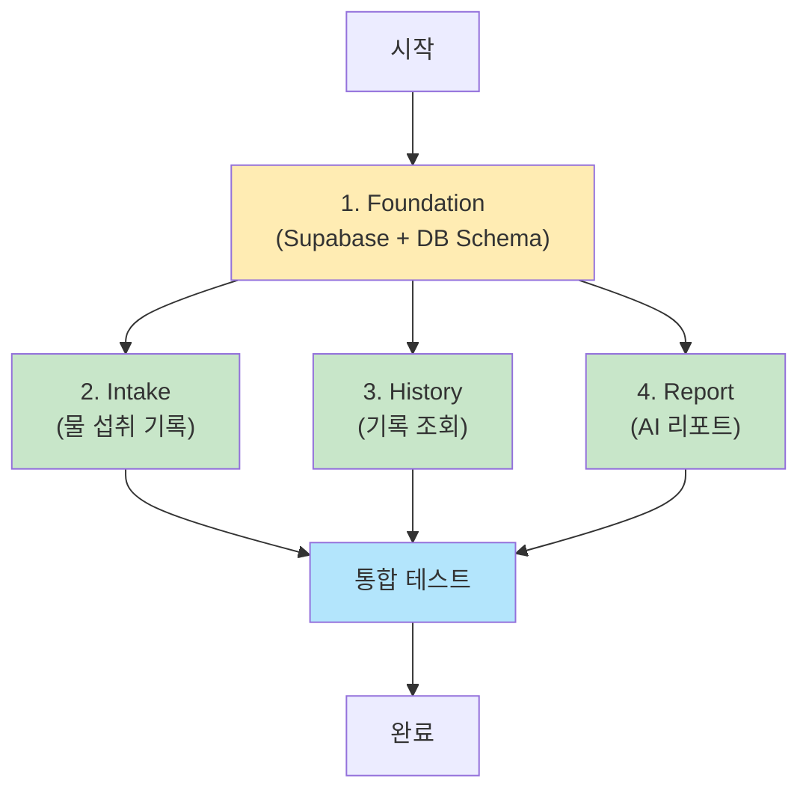

# 백엔드 개발 작업 통합 가이드

## 개요

Water Log 프로젝트의 백엔드 개발을 병렬 가능한 작업 단위로 나누고, 각 작업의 통합 전략을 정의합니다. 프론트엔드는 이미 구현되어 있으며, 백엔드 Server Actions와 Supabase 연동을 추가하는 것이 목표입니다.

---

## 작업 단위 구분

### 1️⃣ Foundation (기초 인프라) - **최우선 작업**
- **목적**: 모든 작업의 기반이 되는 인프라 구축
- **범위**: Supabase 설정, DB 스키마, 공통 유틸리티
- **병렬성**: ❌ 선행 작업 (다른 모든 작업의 사전 조건)
- **담당 파일**:
  - `lib/supabase.ts` (Supabase 클라이언트)
  - `supabase/schema.sql` (데이터베이스 스키마)
  - `.env.local.example` (환경 변수 템플릿)

### 2️⃣ Intake (물 섭취 기록) - **병렬 작업 가능**
- **목적**: 물 섭취 기록 생성, 조회, 삭제 기능 구현
- **범위**: Server Actions for Intake
- **병렬성**: ✅ History, Report와 병렬 작업 가능
- **의존성**: Foundation 완료 필수
- **담당 파일**:
  - `actions/intake.ts` (Server Actions)
  - 연동 컴포넌트: `components/features/intake/intake-recorder.tsx`, `components/features/intake/today-intake-list.tsx`

### 3️⃣ History (기록 조회) - **병렬 작업 가능**
- **목적**: 과거 물 섭취 기록 조회 (읽기 전용)
- **범위**: Server Actions for History (Read-only)
- **병렬성**: ✅ Intake, Report와 병렬 작업 가능
- **의존성**: Foundation 완료 필수
- **담당 파일**:
  - `actions/history.ts` (Server Actions)
  - 연동 컴포넌트: `components/features/history/calendar-view.tsx`

### 4️⃣ Report (AI 리포트) - **병렬 작업 가능**
- **목적**: Gemini API를 통한 AI 리포트 생성 및 조회
- **범위**: Server Actions for AI Reports, Gemini API 연동
- **병렬성**: ✅ Intake, History와 병렬 작업 가능
- **의존성**: Foundation 완료 필수
- **담당 파일**:
  - `actions/report.ts` (Server Actions)
  - `lib/gemini.ts` (Gemini API 클라이언트)
  - 연동 컴포넌트: `components/features/reports/report-generator.tsx`, `components/features/reports/report-list.tsx`

---

## 실행 순서 및 의존성



### 실행 단계

#### Phase 1: Foundation (필수 선행)
1. **Foundation 작업 완료**
   - Supabase 프로젝트 생성 및 스키마 적용
   - `lib/supabase.ts` 클라이언트 설정
   - 환경 변수 설정

#### Phase 2: 병렬 개발 (Foundation 완료 후)
2. **Intake, History, Report 병렬 작업**
   - 각 작업은 독립적으로 진행 가능
   - 서로 다른 파일을 수정하므로 충돌 없음
   - 각 작업은 자체 Server Actions 파일을 생성

#### Phase 3: 통합 및 검증
3. **통합 테스트**
   - 모든 작업 완료 후 통합 테스트
   - 프론트엔드 컴포넌트와 연동 확인

---

## 충돌 방지 전략

### 파일 분리 전략
각 작업은 **독립적인 파일**을 수정하므로 충돌이 발생하지 않습니다.

| 작업 | 생성/수정 파일 |
|------|----------------|
| **Foundation** | `lib/supabase.ts`, `supabase/schema.sql`, `.env.local.example` |
| **Intake** | `actions/intake.ts` |
| **History** | `actions/history.ts` |
| **Report** | `actions/report.ts`, `lib/gemini.ts` |

### 공통 규칙
1. **환경 변수**: Foundation에서만 `.env.local.example` 수정
2. **DB 스키마**: Foundation에서만 `schema.sql` 수정
3. **Supabase 클라이언트**: Foundation에서 생성, 다른 작업은 **읽기 전용 사용**
4. **Server Actions**: 각 작업은 자체 파일만 수정 (`intake.ts`, `history.ts`, `report.ts`)

---

## 프론트엔드 연동 가이드

### Intake 연동
**컴포넌트**: `components/features/intake/intake-recorder.tsx`
```typescript
// 현재 TODO:
// TODO: Server Action으로 기록 저장

// 연동 후:
import { createIntakeLog } from "@/actions/intake"
const result = await createIntakeLog({ amountLevel: level })
```

**컴포넌트**: `components/features/intake/today-intake-list.tsx`
```typescript
// 연동:
import { getTodayIntakeLogs, deleteIntakeLog } from "@/actions/intake"
```

### History 연동
**컴포넌트**: `components/features/history/calendar-view.tsx`
```typescript
// 연동:
import { getIntakeLogsByDateRange } from "@/actions/history"
```

### Report 연동
**컴포넌트**: `components/features/reports/report-generator.tsx`
```typescript
// 현재 TODO:
// TODO: Server Action으로 AI 리포트 생성

// 연동 후:
import { generateReport } from "@/actions/report"
const report = await generateReport()
```

**컴포넌트**: `components/features/reports/report-list.tsx`
```typescript
// 연동:
import { getReports } from "@/actions/report"
```

---

## 작업별 프롬프트

### 1️⃣ Foundation 작업 프롬프트

```
당신은 "Foundation Agent"로서 Water Log 프로젝트의 기초 인프라를 구축합니다.

## 📋 작업 목표
Supabase 설정 및 데이터베이스 스키마 생성, 공통 유틸리티 구축

## 📁 필수 참고 문서
- docs/PRD.md (제품 개요)
- docs/software_design.md (기술 스택 및 DB 설계)
- docs/tasks/task-foundation-plan.md (상세 체크리스트)

## ✅ 완료 조건
1. `lib/supabase.ts` 파일 생성 완료
2. `supabase/schema.sql` 파일 생성 완료
3. `.env.local.example` 파일 생성 완료
4. Supabase 프로젝트 생성 및 스키마 적용

## 🚫 제약사항
- 프론트엔드 코드는 수정하지 않습니다
- 다른 Server Actions 파일(intake.ts, history.ts, report.ts)은 생성하지 않습니다

작업을 시작하세요.
```

---

### 2️⃣ Intake 작업 프롬프트

```
당신은 "Intake Agent"로서 물 섭취 기록 기능을 구현합니다.

## 📋 작업 목표
물 섭취 기록 생성, 조회, 삭제 Server Actions 구현 및 프론트엔드 연동

## 📁 필수 참고 문서
- docs/user_stories.md (US-001 ~ US-007)
- docs/software_design.md (Intake Actions API 설계)
- docs/tasks/task-intake-plan.md (상세 체크리스트)

## 📂 필수 참고 파일
- components/features/intake/intake-recorder.tsx (연동 대상)
- components/features/intake/today-intake-list.tsx (연동 대상)
- lib/supabase.ts (읽기 전용 사용)

## ✅ 완료 조건
1. `actions/intake.ts` 파일 생성 및 Server Actions 구현
2. `intake-recorder.tsx`에서 TODO 제거 및 Server Action 연동
3. `today-intake-list.tsx`에서 데이터 조회 및 삭제 기능 연동
4. 브라우저에서 기록 생성/조회/삭제 동작 확인

## 🚫 제약사항
- `lib/supabase.ts`는 읽기 전용으로만 사용
- `actions/history.ts`, `actions/report.ts`는 수정하지 않습니다
- 컨디션 로그 관련 코드는 작성하지 않습니다

작업을 시작하세요.
```

---

### 3️⃣ History 작업 프롬프트

```
당신은 "History Agent"로서 물 섭취 기록 조회 기능을 구현합니다.

## 📋 작업 목표
과거 물 섭취 기록을 조회하는 Server Actions 구현 (읽기 전용)

## 📁 필수 참고 문서
- docs/user_stories.md (US-004 ~ US-006)
- docs/software_design.md (History Actions API 설계)
- docs/tasks/task-history-plan.md (상세 체크리스트)

## 📂 필수 참고 파일
- components/features/history/calendar-view.tsx (연동 대상)
- lib/supabase.ts (읽기 전용 사용)

## ✅ 완료 조건
1. `actions/history.ts` 파일 생성 및 Server Actions 구현
2. `calendar-view.tsx`에서 기록 조회 기능 연동
3. 캘린더 뷰에서 월별 데이터 표시 확인
4. 브라우저에서 과거 기록 조회 동작 확인

## 🚫 제약사항
- **읽기 전용 작업**: 데이터 생성/수정/삭제 없음
- `lib/supabase.ts`는 읽기 전용으로만 사용
- `actions/intake.ts`, `actions/report.ts`는 수정하지 않습니다

작업을 시작하세요.
```

---

### 4️⃣ Report 작업 프롬프트

```
당신은 "Report Agent"로서 AI 리포트 생성 기능을 구현합니다.

## 📋 작업 목표
Gemini API를 활용한 AI 리포트 생성 및 조회 Server Actions 구현

## 📁 필수 참고 문서
- docs/PRD.md (AI 리포트 요구사항)
- docs/user_stories.md (US-008 ~ US-013)
- docs/software_design.md (Report Actions 및 Gemini API 설계)
- docs/tasks/task-report-plan.md (상세 체크리스트)

## 📂 필수 참고 파일
- components/features/reports/report-generator.tsx (연동 대상)
- components/features/reports/report-list.tsx (연동 대상)
- lib/supabase.ts (읽기 전용 사용)

## ✅ 완료 조건
1. `lib/gemini.ts` 파일 생성 및 Gemini API 클라이언트 구현
2. `actions/report.ts` 파일 생성 및 Server Actions 구현
3. `report-generator.tsx`에서 TODO 제거 및 Server Action 연동
4. `report-list.tsx`에서 리포트 목록 조회 기능 연동
5. 브라우저에서 리포트 생성 및 조회 동작 확인

## 🚫 제약사항
- `lib/supabase.ts`는 읽기 전용으로만 사용
- `actions/intake.ts`, `actions/history.ts`는 수정하지 않습니다
- **Gemini 모델**: 반드시 `gemini-3-flash-preview` 사용

## ⚙️ 환경 변수
`.env.local`에 다음 환경 변수 추가 필요:
```
GEMINI_API_KEY=your-api-key
```

작업을 시작하세요.
```

---

## 통합 검증 체크리스트

모든 작업 완료 후 다음을 확인합니다:

### ✅ Foundation 검증
- [ ] Supabase 프로젝트가 생성되고 스키마가 적용되었는가?
- [ ] `lib/supabase.ts`에서 클라이언트 연결이 정상 동작하는가?
- [ ] 환경 변수가 올바르게 설정되었는가?

### ✅ Intake 검증
- [ ] 홈 페이지에서 물 섭취 기록 버튼 클릭 시 DB에 저장되는가?
- [ ] 오늘의 기록 목록이 화면에 표시되는가?
- [ ] 기록 삭제가 정상 동작하는가?

### ✅ History 검증
- [ ] `/history` 페이지에서 캘린더가 표시되는가?
- [ ] 과거 기록이 날짜별로 올바르게 표시되는가?
- [ ] 날짜 범위 필터가 동작하는가?

### ✅ Report 검증
- [ ] `/reports` 페이지에서 "리포트 생성" 버튼이 동작하는가?
- [ ] Gemini API 호출이 성공하고 리포트가 생성되는가?
- [ ] 생성된 리포트 목록이 표시되는가?
- [ ] 리포트 상세 내용을 볼 수 있는가?

### ✅ 통합 검증
- [ ] 모든 페이지가 에러 없이 로드되는가?
- [ ] 페이지 간 네비게이션이 정상 동작하는가?
- [ ] 데이터 흐름이 올바른가? (Intake → History → Report)

---

## 트러블슈팅

### 충돌 발생 시
1. **파일 충돌**: 각 작업이 서로 다른 파일을 수정하므로 충돌 불가
2. **DB 스키마 충돌**: Foundation만 수정 가능
3. **환경 변수 충돌**: Foundation만 수정 가능

### 통합 이슈
1. **Server Action 호출 실패**: 
   - `lib/supabase.ts` 임포트 경로 확인
   - RLS 정책 확인
2. **Gemini API 호출 실패**:
   - API 키 환경 변수 확인
   - 모델명 `gemini-3-flash-preview` 확인
3. **프론트엔드 연동 실패**:
   - Server Action 함수명 일치 확인
   - `"use server"` 지시자 확인

---

## 참고 자료

- [Supabase Documentation](https://supabase.com/docs)
- [Next.js Server Actions](https://nextjs.org/docs/app/building-your-application/data-fetching/server-actions)
- [Gemini API Documentation](https://ai.google.dev/gemini-api/docs)
- [Gemini 3 Flash Preview Pricing](https://ai.google.dev/gemini-api/docs/pricing?hl=ko&_gl=1*1jsh8g1*_up*MQ..*_ga*OTI1NDg2MDEyLjE3NjYxNjkyOTc.*_ga_P1DBVKWT6V*czE3NjYxNjkyOTckbzEkZzAkdDE3NjYxNjkyOTckajYwJGwwJGgxODE1MzM4MDI1#gemini-3-flash-preview)
